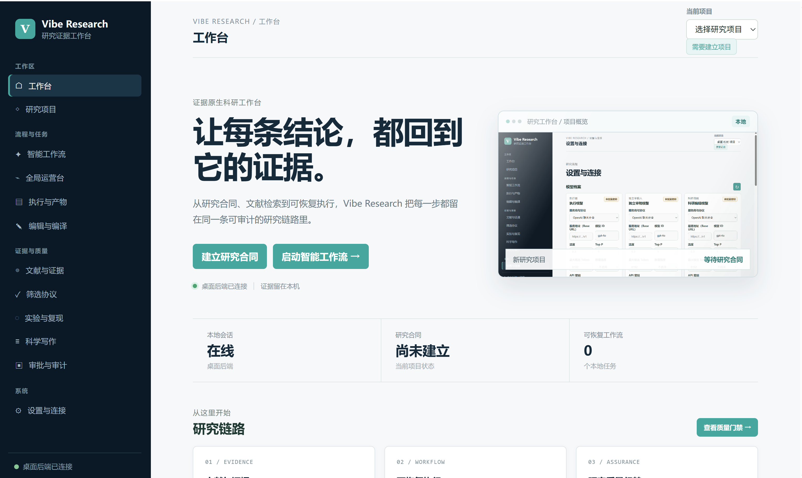
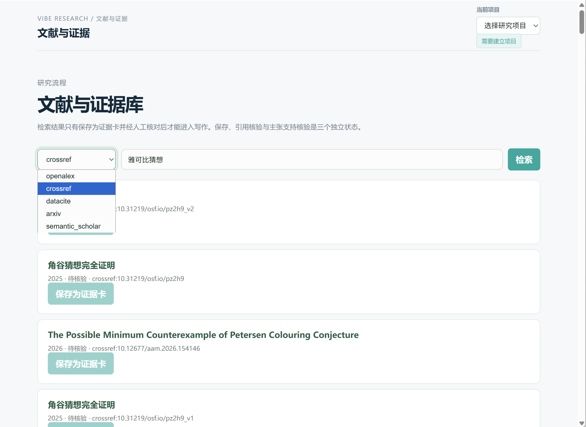

<div align="center">

# 🔬 Vibe Research

**本地 AI 科研证据工作台 · Local AI Research Workbench**

[](https://github.com/yunianwuyang-stack/vibe-research/releases)
[](LICENSE)
[](https://github.com/yunianwuyang-stack/vibe-research)
[](https://electronjs.org)
[](https://python.org)

[🇨🇳 中文文档](#-中文文档) · [🇬🇧 English Docs](#-english-documentation)

</div>

---

<a id="-中文文档"></a>

## 🇨🇳 中文文档

### 项目简介

**Vibe Research** 是一款面向博士生和科研人员的**本地离线 AI 科研证据工作台**。它将学术研究的完整生命周期——从研究合同签订、文献检索与证据审批，到实验执行、科学叙事、再到论文/LaTeX/DOCX 导出——集成为一个可恢复、可审计、证据可追溯的桌面工作台。

与普通 AI 写作工具不同，Vibe Research 的核心理念是**证据优先、失败闭合（Fail-Closed）**：所有主张必须有真实文献或实验数据支撑，系统不产生无来源的伪造内容。

> ⚠️ 本软件旨在提升科研质量与证据可信度，不代表能保证论文录用。学术研究的最终责任由研究者本人承担。

<div align="center">

<br/><em>工作台看板：一屏掌握研究进度、证据覆盖率与工作流状态</em>
<br/><br/>

<br/><em>文献与证据库：多数据源检索，结果须保存为证据卡片并经人工核验后方可进入写作</em>
</div>

---

### ✨ 核心功能

| 功能模块 | 描述 |
|---|---|
| 📋 研究合同 | 定义研究问题、纳入排除标准，作为后续所有步骤的锚点 |
| 📚 文献检索与证据审批 | 对接 AMiner、Semantic Scholar、CrossRef、DBLP，PRISMA 协议筛选，双门控（引文状态 + 主张支持度）证据卡片 |
| 🔬 假设生命周期管理 | 结构化假设录入、支持证据挂接、状态追踪 |
| 🧪 实验规划与执行 | 实验方案模板、执行日志、结果管理，防止硬编码和伪造数据 |
| 🗺️ 科学叙事地图 | 研究问题、文献张力、机制、主张、竞争解释、边界与局限的结构化图谱 |
| 🔗 主张-证据图 | 可溯源、可审计的 Claim Graph，每条主张至少需要一条支持边和反例 |
| 📄 稿件投影 | 从已审批的科学事实派生草稿，禁止无证据内容直接进入稿件 |
| 📤 多格式导出 | LaTeX（XeLaTeX）、DOCX（中英文模板）、Markdown，内置 TeXLive 离线编译 |
| 🤖 多智能体支持 | Claude Code CLI、Codex CLI、OpenAI Compatible API、Gemini、MiniMax |
| 🔄 工作流引擎 | 34 个预置模板（Idea Discovery、Full Pipeline、Auto Review、竞赛数学建模等） |
| 💾 断点续跑 | 工作流崩溃/重启后自动恢复，append-only journal + checkpoint 机制 |
| 🔒 离线优先 | 内置便携 Python 运行时 + TeXLive，核心功能无需联网 |

---

### 🏗️ 技术架构

```
┌──────────────────────────────────────────────────────────┐
│                    Electron 主进程                         │
│  (BrowserWindow · 托盘 · 自动更新 · 本地会话令牌)          │
└─────────────────────────┬────────────────────────────────┘
                          │ IPC / HTTP localhost:18088
┌─────────────────────────▼────────────────────────────────┐
│                 Python FastAPI 后端                        │
│  工作流引擎 │ 研究状态机 │ 文献基础设施 │ LLM 客户端       │
│  SQLite (WAL) │ WebSocket 日志 │ AES-GCM 密钥库           │
└──────────────┬─────────────────────────┬─────────────────┘
               │                         │
┌──────────────▼──────┐     ┌────────────▼────────────────┐
│  React + TypeScript  │     │  Skills 系统（150+ 技能）    │
│  (Vite · Cockpit     │     │  SKILL.md 驱动 · 分组技能包  │
│   Research Map       │     │  Claude/Codex CLI 执行器     │
│   Evidence Page      │     │  工具：scholar · reviewer    │
│   Workflow Ops)      │     │  · docx · tikz · gpt-image  │
└──────────────────────┘     └─────────────────────────────┘
               │
┌──────────────▼──────────────────────────────────────────┐
│            离线运行时（runtime/）                          │
│  Python · Node · TeXLive · Pandoc · Draw.io · Git        │
└─────────────────────────────────────────────────────────┘
```

**前端：** React 18 + TypeScript + Vite · Cockpit 看板 · 研究地图 · 证据页 · 工作流操作面板  
**后端：** Python FastAPI + Uvicorn · SQLite（aiosqlite WAL）· WebSocket 实时推送  
**Agent：** Claude Code CLI / OpenAI Codex CLI / OpenAI-Compatible / Gemini / MiniMax  
**文档：** TeXLive（内置）· Pandoc · python-docx · Draw.io · GPT-Image

---

### 🔬 研究工作流

Vibe Research 遵循**黄金路径（Golden Path）**研究方法，每步均设有不可绕过的证据门控：

```
研究合同（研究问题 + 纳入标准）
    ↓
文献检索 & PRISMA 协议筛选
    ↓
证据卡片双门控审批（引文核验 + 主张支持度）
    ↓
假设注册 & 科学叙事地图审批
    ↓
实验规划 & 执行（防伪数据门控）
    ↓
主张-证据图（Claim Graph with provenance）
    ↓
稿件投影（仅从已审批科学事实生成草稿）
    ↓
外部审稿 & 红队审查
    ↓
论文导出（LaTeX / DOCX / Markdown）
```

每个阶段均有 checkpoint，支持中断后从断点恢复，全程保留可审计的 receipt 与事件日志。

---

### 🚀 快速开始

#### 系统要求

- **操作系统：** Windows 10 / 11（64 位）
- **磁盘空间：** ≥ 8 GB（含内置运行时）
- **内存：** ≥ 8 GB RAM（推荐 16 GB）
- **网络：** 文献检索功能需要联网；核心工作流可离线运行

#### 安装

1. 从 [Releases](https://github.com/your-repo/vibe-research/releases) 下载最新安装包：
   - **安装版：** `Vibe-Research-1.2.2-Setup.exe`（推荐，支持自定义安装目录）
   - **便携版：** `win-unpacked/Vibe Research.exe`（无需安装，直接运行）
2. 运行安装包，按向导完成安装。
3. 启动 **Vibe Research**，应用会自动启动内置 Python 后端。

> 💡 安装包当前未经数字签名，Windows SmartScreen 可能弹出警告，选择"仍要运行"即可。

#### 完整性校验

```powershell
# 校验安装包 SHA-256（对比 release/SHA256SUMS.txt）
Get-FileHash "Vibe-Research-1.2.2-Setup.exe" -Algorithm SHA256
```

---

### ⚙️ 配置

首次启动后，进入 **设置** 页面配置 AI 模型：

| 配置项 | 说明 |
|---|---|
| `OPENAI_API_KEY` | OpenAI / OpenAI-Compatible 模型 API 密钥 |
| `OPENAI_BASE_URL` | 自定义 API 地址（如国内镜像或私有部署） |
| `AMINER_API_KEY` | AMiner 学术数据库 API 密钥（用于中文文献检索） |
| `GPT_IMAGE_API_KEY` | 图像生成功能 API 密钥 |
| `REVIEWER_MODEL_ID` | 审稿 Agent 使用的模型 ID |

所有密钥均通过 **AES-GCM** 加密存储于本地，不会上传至任何服务器。

也可在项目根目录创建 `.env` 文件（参考 `.env.example`）进行配置。

---

### 🛠️ 预置工作流模板（34 个）

| 类别 | 模板 |
|---|---|
| 完整科研流程 | Full Pipeline · Idea Discovery · Research Refine |
| 论文写作 | Paper Write（英文/中文/Nature 风格）· DOCX 版 · Auto Review |
| 实验支持 | Experiment Bridge · Run Experiment · Monitor Experiment |
| 综述与文献 | Literature Review · Comm Lit Review · Paper Analysis |
| 竞赛 | 数学建模竞赛（Comp Modeling · Comp Code · Comp Paper 等） |
| 学位论文 | DSE Loop · Thesis Proposal · Grant Proposal |
| 课程作业 | Course Paper · Course Report · Course Plan |
| 代码开发 | Dev Code · Dev Design · Dev Report |

---

### 🧪 开发与构建

```powershell
# 安装依赖
npm install
pip install -r backend/requirements.txt

# 开发模式运行（Vite + FastAPI）
cd frontend && npm run dev
python backend/main.py

# 运行测试
$env:PYTHONUTF8='1'; $env:PYTHONIOENCODING='utf-8'
runtime\python\python.exe -m pytest -q tests
cd frontend; npm run typecheck; npm test -- --run

# 打包发布（Windows）
npm run build:release
```

---

### 📦 第三方许可证与 SBOM

本项目随附完整软件物料清单：
- `SBOM.cdx.json`（CycloneDX 格式）
- `SBOM.spdx.json`（SPDX 格式）
- `THIRD_PARTY_NOTICES.md`（第三方许可声明）

---

### 🙏 致谢与参考项目

本项目在设计与实现过程中参考并借鉴了以下开源项目，对这些项目的贡献者表示衷心感谢：

| 项目 | 贡献方向 |
|---|---|
| [Auto-claude-code-research-in-sleep](https://github.com/wanshuiyin/Auto-claude-code-research-in-sleep) | 无人值守 Claude Code CLI 自主研究执行模式、任务封装与 checkpoint 机制 |
| [ruflo](https://github.com/ruvnet/ruflo) | 工作流编排引擎设计、Skill 运行器与技能包管理机制 |
| [local-deep-research](https://github.com/LearningCircuit/local-deep-research) | 本地离线深度文献检索、多数据源聚合与系统综述协议 |
| [Rethlas](https://github.com/frenzymath/Rethlas) | 学术文档生成、LaTeX/DOCX 工具链集成与写作规则体系 |

> 💡 请在发布前将上方表格中的链接替换为各项目的真实 GitHub 地址。

---

### 📄 许可证

本项目采用 [MIT 许可证](LICENSE) 开源。

Copyright © 2026 Vibe Research contributors

---

<a id="-english-documentation"></a>

## 🇬🇧 English Documentation

### Introduction

**Vibe Research** is a **local offline AI research evidence workbench** designed for PhD students and researchers. It integrates the complete academic research lifecycle—from research contract definition, literature search & evidence screening, to experiment execution, scientific narrative construction, and manuscript export (LaTeX/DOCX/Markdown)—into a recoverable, auditable, evidence-traceable desktop workstation.

Unlike typical AI writing assistants, Vibe Research's core philosophy is **evidence-first, fail-closed design**: all claims must be backed by real literature or experimental data, and the system never generates fabricated content without sources.

> ⚠️ This software aims to enhance research quality and evidence credibility, but does not guarantee paper acceptance. The final responsibility for academic research rests with the researcher.

---

### ✨ Core Features

| Module | Description |
|---|---|
| 📋 Research Contract | Define research questions, inclusion/exclusion criteria as anchor for all downstream steps |
| 📚 Literature & Evidence Screening | Integration with AMiner, Semantic Scholar, CrossRef, DBLP; PRISMA protocol screening; dual-gate evidence cards (citation status + claim support) |
| 🔬 Hypothesis Lifecycle | Structured hypothesis registry, supporting evidence attachment, status tracking |
| 🧪 Experiment Planning & Execution | Experiment plan templates, execution logs, result management, preventing hardcoded/fake data |
| 🗺️ Scientific Narrative Map | Structured map of research question, literature tension, mechanism, claims, competing explanations, boundaries & limitations |
| 🔗 Claim-Evidence Graph | Traceable, auditable Claim Graph; each claim requires at least one support edge and counterexample |
| 📄 Manuscript Projection | Derive drafts only from approved scientific facts; no evidence-free content in manuscripts |
| 📤 Multi-Format Export | LaTeX (XeLaTeX), DOCX (Chinese/English templates), Markdown; bundled offline TeXLive compilation |
| 🤖 Multi-Agent Support | Claude Code CLI, Codex CLI, OpenAI Compatible API, Gemini, MiniMax |
| 🔄 Workflow Engine | 34 preset templates (Idea Discovery, Full Pipeline, Auto Review, Math Modeling Competition, etc.) |
| 💾 Auto-Resume from Crash | Workflow recovery after crash/restart via append-only journal + checkpoint mechanism |
| 🔒 Offline-First | Bundled portable Python runtime + TeXLive; core features work without internet |

---

### 🏗️ Technical Architecture

```
┌──────────────────────────────────────────────────────────┐
│                  Electron Main Process                     │
│  (BrowserWindow · Tray · Auto-update · Local session token)│
└─────────────────────────┬────────────────────────────────┘
                          │ IPC / HTTP localhost:18088
┌─────────────────────────▼────────────────────────────────┐
│                Python FastAPI Backend                      │
│  Workflow Engine │ Research State Machine │ Literature    │
│  SQLite (WAL) │ WebSocket Logs │ AES-GCM Secret Store     │
└──────────────┬─────────────────────────┬─────────────────┘
               │                         │
┌──────────────▼──────┐     ┌────────────▼────────────────┐
│  React + TypeScript  │     │  Skills System (150+ skills) │
│  (Vite · Cockpit     │     │  SKILL.md-driven · Skill packs│
│   Research Map       │     │  Claude/Codex CLI runners     │
│   Evidence Page      │     │  Tools: scholar · reviewer    │
│   Workflow Ops)      │     │  · docx · tikz · gpt-image   │
└──────────────────────┘     └─────────────────────────────┘
               │
┌──────────────▼──────────────────────────────────────────┐
│            Offline Runtime (runtime/)                     │
│  Python · Node · TeXLive · Pandoc · Draw.io · Git        │
└─────────────────────────────────────────────────────────┘
```

**Frontend:** React 18 + TypeScript + Vite · Cockpit dashboard · Research map · Evidence page · Workflow operations  
**Backend:** Python FastAPI + Uvicorn · SQLite (aiosqlite WAL) · WebSocket real-time push  
**Agents:** Claude Code CLI / OpenAI Codex CLI / OpenAI-Compatible / Gemini / MiniMax  
**Documents:** TeXLive (bundled) · Pandoc · python-docx · Draw.io · GPT-Image

---

### 🔬 Research Workflow

Vibe Research follows the **Golden Path** research methodology with non-bypassable evidence gates at each step:

```
Research Contract (research question + inclusion criteria)
    ↓
Literature Search & PRISMA Protocol Screening
    ↓
Evidence Card Dual-Gate Approval (citation verification + claim support)
    ↓
Hypothesis Registration & Scientific Narrative Map Approval
    ↓
Experiment Planning & Execution (anti-fake-data gates)
    ↓
Claim-Evidence Graph (Claim Graph with provenance)
    ↓
Manuscript Projection (only from approved scientific facts)
    ↓
External Review & Red Team Audit
    ↓
Paper Export (LaTeX / DOCX / Markdown)
```

Each stage has checkpoints, supports resuming from interruption, and maintains auditable receipts & event logs throughout.

---

### 🚀 Quick Start

#### System Requirements

- **OS:** Windows 10 / 11 (64-bit)
- **Disk:** ≥ 8 GB (including bundled runtime)
- **Memory:** ≥ 8 GB RAM (16 GB recommended)
- **Network:** Required for literature search; core workflows run offline

#### Installation

1. Download the latest release from [Releases](https://github.com/your-repo/vibe-research/releases):
   - **Installer:** `Vibe-Research-1.2.2-Setup.exe` (recommended, supports custom install directory)
   - **Portable:** `win-unpacked/Vibe Research.exe` (run directly, no installation needed)
2. Run the installer and follow the wizard.
3. Launch **Vibe Research** — the app automatically starts the built-in Python backend.

> 💡 The installer is currently unsigned. Windows SmartScreen may show a warning; click "Run anyway" to proceed.

#### Integrity Verification

```powershell
# Verify SHA-256 against release/SHA256SUMS.txt
Get-FileHash "Vibe-Research-1.2.2-Setup.exe" -Algorithm SHA256
```

---

### ⚙️ Configuration

After first launch, open the **Settings** panel to configure AI models:

| Key | Description |
|---|---|
| `OPENAI_API_KEY` | API key for OpenAI or any OpenAI-compatible provider |
| `OPENAI_BASE_URL` | Custom API endpoint (e.g., local proxy or private deployment) |
| `AMINER_API_KEY` | AMiner academic database key (Chinese literature search) |
| `GPT_IMAGE_API_KEY` | API key for image generation |
| `REVIEWER_MODEL_ID` | Model ID for the reviewer agent |

All secrets are encrypted locally with **AES-GCM** and are never sent to external servers.

Alternatively, create a `.env` file in the project root (see `.env.example`).

---

### 🛠️ Preset Workflow Templates (34 total)

| Category | Templates |
|---|---|
| Full Research Pipeline | Full Pipeline · Idea Discovery · Research Refine |
| Paper Writing | Paper Write (EN/ZH/Nature style) · DOCX variant · Auto Review |
| Experiment Support | Experiment Bridge · Run Experiment · Monitor Experiment |
| Literature Review | Literature Review · Comm Lit Review · Paper Analysis |
| Competition | Math Modeling (Comp Modeling · Comp Code · Comp Paper, etc.) |
| Thesis | DSE Loop · Thesis Proposal · Grant Proposal |
| Course Work | Course Paper · Course Report · Course Plan |
| Development | Dev Code · Dev Design · Dev Report |

---

### 🧪 Development & Build

```powershell
# Install dependencies
npm install
pip install -r backend/requirements.txt

# Development mode (Vite + FastAPI)
cd frontend && npm run dev
python backend/main.py

# Run tests
$env:PYTHONUTF8='1'; $env:PYTHONIOENCODING='utf-8'
runtime\python\python.exe -m pytest -q tests
cd frontend; npm run typecheck; npm test -- --run

# Build for Windows release
npm run build:release
```

---

### 📦 Third-Party Licenses & SBOM

This project ships with a full Software Bill of Materials:
- `SBOM.cdx.json` (CycloneDX format)
- `SBOM.spdx.json` (SPDX format)
- `THIRD_PARTY_NOTICES.md` (third-party license notices)

---

### 🙏 Acknowledgements

This project was inspired by and builds upon the following open-source works. We sincerely thank their contributors:

| Project | Contribution to Vibe Research |
|---|---|
| [Auto-claude-code-research-in-sleep](https://github.com/wanshuiyin/Auto-claude-code-research-in-sleep) | Unattended Claude Code CLI autonomous research execution model, task encapsulation & checkpoint mechanism |
| [ruflo](https://github.com/ruvnet/ruflo) | Workflow orchestration engine design, skill runner & skill pack management |
| [local-deep-research](https://github.com/LearningCircuit/local-deep-research) | Local offline deep literature search, multi-source aggregation & systematic review protocol |
| [Rethlas](https://github.com/frenzymath/Rethlas) | Academic document generation, LaTeX/DOCX toolchain integration & writing rules framework |

---

### 📄 License

This project is open-sourced under the [MIT License](LICENSE).

Copyright © 2026 Vibe Research contributors

