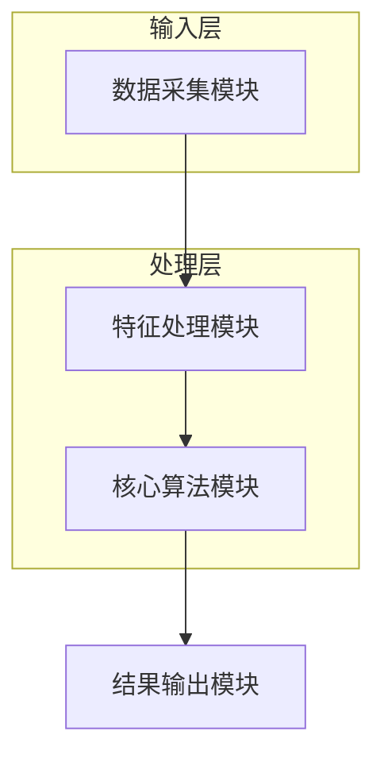

# 专利技术交底书 · 起草阶段（patent-draft）

本步骤根据 `CLAUDE.md` 注入的**案件名称**和**技术描述/交底要点**，由 AI **直接撰写**一份完整的专利技术交底书草稿，输出到 `专利交底书/交底书草稿.md`。下一步 `patent-build` 会把其中的 mermaid 围栏渲染成 PNG 并导出 Word。

## 场景与硬约束

- **两种输入模式，先判断当前属于哪种：**
  - **A. 用户上传了真实材料**：`CLAUDE.md` 会写明"用户已上传真实材料"，且 `user_data/` 下有文件（技术文档、设计说明、源代码等）。此时先用 `Glob`（**递归** `user_data/**`）/`Read` 通读这些材料——上传的压缩包已被后端**自动解压成子目录**，务必递归查找。**据实提炼**技术背景、要解决的技术问题、核心技术方案与创新点，写入交底书各章；技术方案、实施例、参数要与上传材料一致，`CLAUDE.md` 注入的技术描述仅作补充。
  - **B. 用户未上传材料**：`user_data/` 为空。此时按 `CLAUDE.md` 注入的案件名与技术描述，由 AI 直接撰写交底书。
- ⛔ 无论哪种模式，都**不要**调用 `docx_to_md.py`/`pptx_to_md.py`/`cnipa_epub_search.py` 等脚本（本工作流不提供它们）；模式 A 直接用 `Read` 读 `user_data/` 里的文本/代码即可。老 skill 里的 Step 1-8 分步 prompts 文件在工作区中**不存在**，不要 `Read prompts/*.md`；本文件已内联全部要点。
- **查新降级为 WebSearch**：需要现有技术对比时，用 WebSearch 检索相近专利/文献，理解其技术方案与局限，写入第一章。找不到可靠公开来源时，如实按技术常识概述现有技术方向，不虚构专利号和链接。
- **系统框图（3.2）与流程图（3.4）一律用 fenced ```mermaid``` 源码**，不要 ASCII 文字框图/箭头流程图。下一步会渲染成 PNG。
- 输出固定为 `专利交底书/交底书草稿.md`（单文件，不带时间戳后缀——时间戳命名是老 skill 的交付惯例，本工作流由 patent-build 统一导出 Word）。
- **正文止于第六章**。不得包含"自检清单"章节，不得在文末加入指向技能/示例仓库的脚注、免责声明或"教学示例"字样。
- 起草完成后，向用户简要汇报交底书要点，平台会触发一次人工检查点等待确认；确认后进入 patent-build 导出 Word。

## 章节结构（严格按此撰写）

```
文档头部（案件名称、技术联系人、专利类型、注意事项）
一、技术背景与现有技术
   1.1 现有技术（按技术方向分类；查新结果，WebSearch 来源）
   1.2 现有技术存在的缺点
二、本发明所要解决的技术问题
三、本发明技术方案的详细阐述
   3.1 背景
   3.2 系统框图（fenced mermaid）
   3.3 模块功能说明（作用与关联关系，非输入输出）
   3.4 系统流程说明（fenced mermaid 流程图 + 文字说明）
   3.4.1 符号与公式（出现公式/形式化变量时必设；先符号定义，再公式）
   3.5 关键技术参数（参数表「符号」列与 3.4.1 同形）
四、与现有技术相比的优点
五、技术关键点和欲保护点
六、其它（实施例、技术效果、参数示例）
```

## 文档头部模板

```markdown
# 技术交底书

**案件名称**：<CLAUDE.md 注入的案件名称，形如"一种XXX方法及系统">

**技术联系人**：
- 姓名：[待填写]
- 电话：[待填写]
- 邮箱：[待填写]

**专利类型**：发明

---

## 注意事项

（1）交底书应使代理人能看懂，尤其是背景技术和详细技术方案，一定要写得全面、清楚、完整；
（2）技术的公开程度，应以本领域普通技术人员不需付出创造性劳动即可进行实施为准。
（3）在与代理人沟通时，对于代理人咨询的技术问题，应给予回答并认真讲解，并按要求及时正确地补充相应技术材料。
```

`**案件名称**：` 行必须写实际案件名（CLAUDE.md 注入；未注入时据技术描述拟一个"一种……方法及系统"式名称）。

## mermaid 图示规范

系统框图（3.2）推荐 `flowchart TB`/`LR` + `subgraph` 分层；节点标签用简短中文/数字，避免 ①②③。模块名抽象通用，避免具体业务术语。示例：

````markdown

````

流程图（3.4）同样用 fenced ```mermaid``` 围栏，另配简短文字说明各步骤，但不得用 ASCII 框线箭头代替图示。

## 符号与公式体例（出现公式时必遵）

- **先写符号表**（符号、含义、下标含义、量纲/取值范围），再写公式；式中符号与符号表同形同义。
- **禁止同一字母多义**。资源维度/类型标签（cpu、mem 等）写入**下标**并用正体 `\mathrm{cpu}`，如 `b_{i,\mathrm{cpu}}`；**禁止**用上标 `^{cpu}` 表示维度。
- 行内公式全文统一 `\(...\)` 或 `$...$` 二选一；块级公式统一 `\[...\]` 或 `$$...$$` 二选一，不混用。比较符用 `\leq`/`\geq`。块级公式尽量单行写完。
- 逻辑连接词（且/或）优先写在公式外的中文叙述里。
- 3.4.1 符号表、正文首次定义式、3.5「符号」列、第六章实施例四处逐字同形。

## 脱敏要求

| 类型 | 脱敏方式 |
|------|----------|
| 业务/行业名称 | 抽象为通用描述 |
| 具体分类标签 | 分类A、分类B、分类C 等 |
| 具体数值 | 用范围或"一定规模""预设值"说明 |
| 公司/产品名 | 删除或替换为"某系统" |

## 撰写要点

- 第一章每条现有技术尽量给出可核验的公开来源（WebSearch 得到的专利号/文献 + URL）；无可靠来源时如实按技术方向概述，不编造专利号和链接。
- 第三章是核心，要写全、写清，让代理人不需创造性劳动即可实施。3.3 聚焦模块作用与关联关系。
- 第五章列核心创新点，详细方案引用第三章（如"具体实现见 3.4.1"），避免大段重复。
- 第六章实施例的参数示例注明"不作为权利要求限制"。
- 全文脱敏、口径一致、公式符号跨节同形。

## 完成自检（内部执行，不写入正文）

结束前确认：`专利交底书/交底书草稿.md` 已生成；`**案件名称**：` 行为实际案件名；六章齐全且止于第六章；3.2 和 3.4 均为 fenced ```mermaid``` 源码（非 ASCII）；无"自检清单"章节；文末无仓库/技能脚注或免责声明；若含公式则符号表先行且跨节同形。
