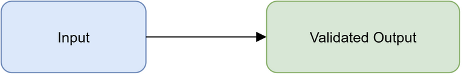

# Vibe Research 文档流水线实产物验证

## 摘要

本文档验证 Vibe Research 的本地文档流水线。验证对象包括 LaTeX 源文件、PDF、DOCX 与真实图片，并检查文件结构、可读文本、媒体嵌入和调用链日志。

## 调用链

1. draw.io CLI 从 `pipeline.drawio` 生成 PNG/PDF 图。
2. XeLaTeX 读取 `paper/main.tex` 并嵌入 PNG，生成 `paper/main.pdf`。
3. 产品 DOCX 引擎（Node `docx-cn-engine` 或 Python `tools/docx_export.py`）将本文 Markdown 转换为 Word。

## 质量检查

| 产物 | 验证项 |
|---|---|
| PDF | 页数、文本、图片对象、文件大小 |
| DOCX | ZIP 结构、段落、媒体、关系文件 |
| image | PNG 魔数、尺寸、非空像素内容 |

结论：所有产物均在本地生成，不依赖外部网络服务。
